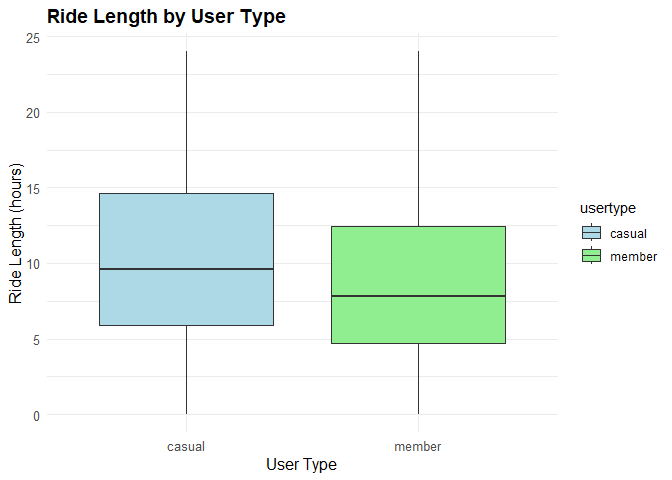
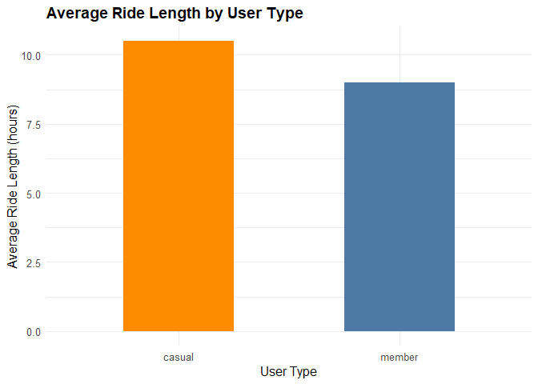
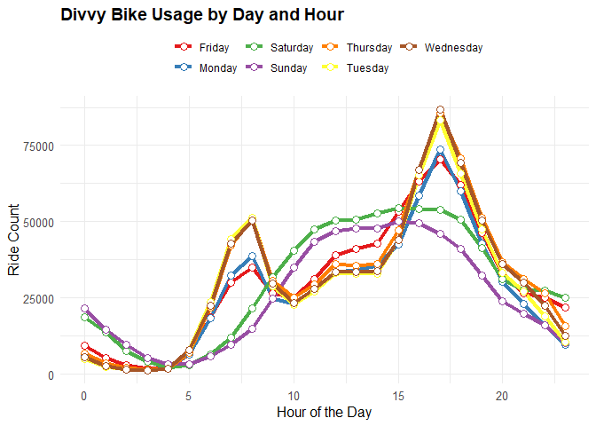
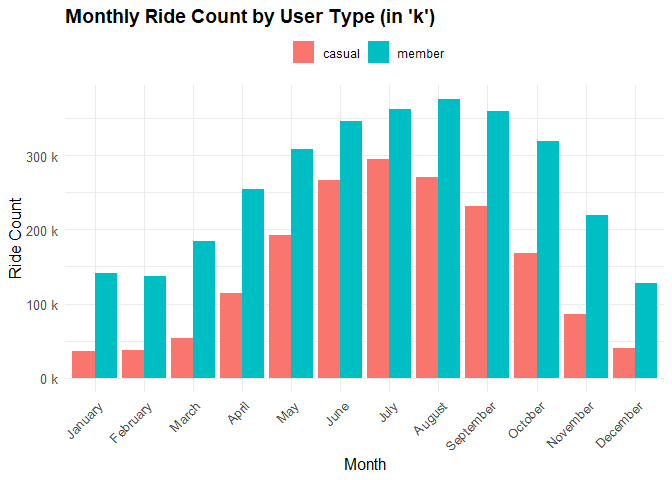
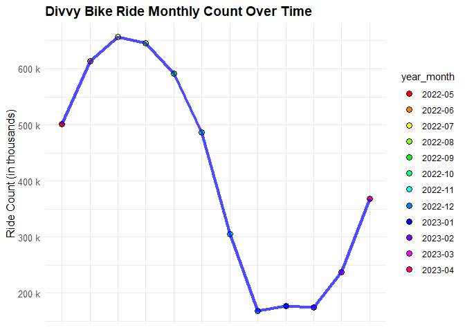

# Google Analytics Capstone Project


Welcome to my capstone project for the Google Analytics Certification training I completed in May 2023. Over the course of three months, I honed my skills in SQL, Excel, and R. Ultimately, I chose R for this project due to its excellent capabilities for data analysis and visualization.

## Table of Contents

1. [Data Collection and Preparation](#data-collection-and-preparation)
2. [Data Wrangling](#data-wrangling)
3. [Data Cleaning](#data-cleaning)
4. [Descriptive Analysis](#descriptive-analysis)
5. [Data Visualization](#data-visualization)
6. [Analysis Summary](#Analysis-summary)

## Data Collection and Preparation <a name="data-collection-and-preparation"></a>

The script begins by importing the necessary packages, including `tidyverse`, `lubridate`, and `ggplot2`. We load data from [Divvy bike sharing](https://divvy-tripdata.s3.amazonaws.com/index.html) for each month from May 2022 to April 2023 into separate dataframes. The data is then validated for consistency in column names and appropriately renamed to ensure uniformity across all dataframes.

## Data Wrangling <a name="data-wrangling"></a>

During the data wrangling phase, all the monthly dataframes are amalgamated into a single dataframe named `all_trips`. Latitude and longitude fields are discarded as they are not essential for this analysis. New columns are added which encompass the date, month, day, year, day of the week, and ride length for each ride.

## Data Cleaning <a name="data-cleaning"></a>

The data is further polished by converting the ride length from a factor to a numeric field, thereby facilitating numerical computations. The script also expunges “bad” data, such as records where the ride length is negative.

## Descriptive Analysis <a name="descriptive-analysis"></a>

The script executes descriptive analysis on the `ride_length` column, summarizing the data and comparing members and casual users. It aggregates ride lengths by user type and day of the week to compute average ride durations. Furthermore, it groups the data by user type and weekday, evaluating the number of rides and average duration.

## Data Visualization <a name="data-visualization"></a>

The script employs `ggplot2` to design charts representing the number of rides and average ride duration by rider type and weekday.

## Analysis Summary <a name="analysis-summary"></a>

My analysis revealed interesting patterns and insights about bike ride durations, daily and hourly usage, as well as monthly ride patterns for different user types.

### Ride Durations: 
Casual users generally took longer rides, typically around 10 hours, while member users preferred shorter rides. The variance in ride durations was also greater for casual users, suggesting that their usage of the service is less predictable.

### Daily and Hourly Usage: 
The analysis showed significant variation in bike usage patterns depending on the day of the week and the hour of the day. Wednesdays had the highest overall usage, with the busiest hour being 5 pm, hinting at a possible commuting use for the service. More granular data would provide further insights into these usage patterns and help ensure bike availability during peak usage times.

### Monthly Ride Patterns: 
The bar chart showed that member rides outnumbered casual rides for each month, implying that members use the service more consistently year-round. Both user types increased their usage from January to July, with usage peaking in summer (June, July, and August), and decreasing towards the end of the year.

### Ride Length Analysis: 
The data pointed to the highest number of rides in July 2022 (approx. 657,000 rides) and the lowest in December 2022 (approx. 169,000 rides). This fluctuation in ride counts throughout the year seems to be influenced by seasonal factors, with usage peaking in summer and decreasing in winter.

These findings provide valuable insights into how different types of users utilize the bike service and how usage patterns change over time. Such understanding can be leveraged to better manage the bike fleet and align service provision with user needs.

## Required Packages <a name="required-packages"></a>

```r
required_packages <- c("lubridate", "tidyverse", "ggplot2", "hms", "flexdashboard", "purrr", "readr")
for (package in required_packages) {
  if (!require(package, character.only = TRUE)) {
    install.packages(package)
    library(package, character.only = TRUE)
  }
}
```
Data Import and Consolidation <a name="data-import-and-consolidation"></a>
A list of file names in the “data” directory is generated. All CSV files are read and combined into a single dataframe.
```r
file_list <- list.files("data/", pattern = "\\.csv$", full.names = TRUE)
all_trips <- bind_rows(lapply(file_list, read_csv))
```
Data Wrangling <a name="data-wrangling"></a>
Columns are renamed for better readability, and new columns for dates and times are added.
```r
all_trips <- all_trips %>%
  rename(
    trip_id = ride_id,
    bikeid = rideable_type,
    start_time = started_at,
    end_time = ended_at,
    from_station_name = start_station_name,
    from_station_id = start_station_id,
    to_station_name = end_station_name,
    to_station_id = end_station_id,
    start_lat = start_lat,
    start_lng = start_lng,
    end_lat = end_lat,
    end_lng = end_lng,
    usertype = member_casual
  ) %>%
  mutate(
    date = as.Date(start_time),
    month = month(date),
    day = day(date),
    year = year(date),
    day_of_week = weekdays(date)
  )
```

   ## Data Cleaning <a name="data-cleaning"></a>

The script drops unnecessary columns (latitude and longitude fields) and converts the start time and end time from factors to numeric fields.

```R
all_trips <- all_trips %>%  
  select(-c(start_lat, start_lng, end_lat, end_lng))

all_trips$start_time <- ymd_hms(all_trips$start_time)
all_trips$end_time <- ymd_hms(all_trips$end_time)
```
Data Inspection <a name="data-inspection"></a>
The new table is inspected to understand the structure, variables, and initial statistics.

List of column names
```r
colnames(all_trips)
```


Number of rows in data frame
```r
nrow(all_trips)
```

Dimensions of the data frame
```r
dim(all_trips)
```

Display the first 6 rows of data frame
```r
head(all_trips)
```

Statistical summary of data (mainly for numerical variables)
```r
summary(all_trips)
```

## Further Data Cleaning <a name="further-data-cleaning"></a>

The script calculates ride length and converts it from a factor to numeric. Furthermore, it removes unlikely ride lengths (e.g., negative values or excessively long rides).

```r
# Adding the ride length column
all_trips$ride_length <- difftime(all_trips$end_time,all_trips$start_time)

# Converting "ride_length" from Factor to numeric
all_trips$ride_length <- as.numeric(as.character(all_trips$ride_length))

# Removing negative ride_length values, creating a new version of the dataframe (v2) since data is being removed
all_trips_v2 <- all_trips[!(all_trips$ride_length < 0),]
```
The script also accounts for unlikely ride durations, filtering out rides shorter than 1 minute or longer than 24 hours, as these durations may indicate that users forgot to end their trips.
```r
all_trips_v2 <- all_trips_v2 %>%
  filter(ride_length >= 1 & ride_length <= 60 * 24)
```
Converting ride length from minutes to hours, rounding the result to two decimal places.
```r
all_trips_v2$ride_length <- round(all_trips_v2$ride_length / 60, 2)
```
### Descriptive Analysis and Data Visualization::

#### Ride Length Analysis
```r
    summary(all_trips_v2$ride_length)

    ##    Min. 1st Qu.  Median    Mean 3rd Qu.    Max. 
    ##   0.020   5.050   8.430   9.543  13.280  24.000
```

#### Visualization::
```r
    ggplot(all_trips_v2, aes(x = usertype, y = ride_length, fill = usertype)) +
      geom_boxplot() +
      labs(
        x = "User Type",
        y = "Ride Length (hours)",  
        title = "Ride Length by User Type"
      ) +
      scale_fill_manual(values = c("lightblue", "lightgreen")) +
      theme_minimal() +
      theme(
        axis.title.x = element_text(size = 12),
        axis.title.y = element_text(size = 12),
        axis.text = element_text(size = 10),
        plot.title = element_text(size = 14, face = "bold")
      )
```


The data presents an interesting distinction in ride durations between
casual and member users. Casual users, on average, tend to enjoy longer
rides, typically around 10 hours. They show a wide variance, with some
rides extending from slightly over 5 hours to just below 15 hours.
Conversely, member users generally prefer shorter rides. The following
plot shows the average hourly usage in more details
```r
    # Calculate the average ride length by user type
    avg_ride_length <- all_trips_v2 %>%
      group_by(usertype) %>%
      summarise(avg_ride_length = mean(ride_length, na.rm = TRUE))

    # Create a bar plot with custom color palette
    ggplot(avg_ride_length, aes(x = usertype, y = avg_ride_length, fill = usertype)) +
      geom_bar(stat = "identity", width = 0.5) +
      labs(
        x = "User Type",
        y = "Average Ride Length (hours)",
        title = "Average Ride Length by User Type"
      ) +
      scale_fill_manual(values = c("#FF8C00", "#4C79A6")) +
      theme_minimal() +
      theme(
        legend.position = "none",
        axis.title.x = element_text(size = 12),
        axis.title.y = element_text(size = 12),
        axis.text = element_text(size = 10),
        plot.title = element_text(size = 14, face = "bold")
      )
```


Determine the day and hour that reflect the highest usage in the Divvy
bike data, you can analyze the data based on the number of rides by day
of the week and hour of the day.
```r
    # Calculate the number of rides by day of the week and hour of the day
    usage_by_day_hour <- all_trips_v2 %>%
      group_by(day_of_week, hour = hour(start_time)) %>%
      summarise(ride_count = n(), .groups = "drop") %>%
      arrange(day_of_week, hour)

    # Find the day and hour with the highest usage
    max_usage <- usage_by_day_hour %>%
      filter(ride_count == max(ride_count))

    # Plot the number of rides by day of the week and hour of the day
    ggplot(usage_by_day_hour, aes(x = hour, y = ride_count, group = day_of_week, color = day_of_week)) +
      geom_line(size = 1.5) +
      geom_point(size = 3, shape = 21, fill = "white") +
      scale_color_brewer(palette = "Set1") +
      labs(
        x = "Hour of the Day",
        y = "Ride Count",
        title = "Divvy Bike Usage by Day and Hour"
      ) +
      theme_minimal() +
      theme(
        legend.position = "top",
        legend.title = element_blank(),
        axis.title.x = element_text(size = 12),
        axis.title.y = element_text(size = 12),
        axis.text = element_text(size = 10),
        plot.title = element_text(size = 14, face = "bold")
      )
    #cat("Day with the highest usage:", max_usage$day_of_week, "\n")
    #cat("Hour with the highest usage:", max_usage$hour, "\n")
    # Day with the highest usage: Wednesday 
    # Hour with the highest usage: 5  pm
```
  


This plot provides an overview of the bike usage patterns throughout the
week, segmented by the hour of the day. The lines for each day represent
the number of rides taken during each hour, allowing us to observe the
peaks and troughs of usage.

The data suggests that bike usage patterns change significantly
depending on the day of the week and the hour of the day. Some hours
show consistently high bike usage across all days of the week, while
others show variable usage.

Interestingly, the day with the highest overall usage is Wednesday, and
the hour with the most rides is 5 pm. This might indicate that a
significant number of users are using the service for commuting
purposes, as this hour typically aligns with the end of a standard
workday.

However, it would be beneficial to look at the data more granularly to
understand if this pattern holds across all days, or if there are
specific days where the usage at 5 pm is particularly high. This
information could be used to manage the bike fleet more effectively and
ensure high availability during peak usage times.

```r
    library(scales)
```

   Define a vector of month names
   ```r
    month_names <- c("January", "February", "March", "April", "May", "June", "July", "August", "September", "October", "November", "December")
   ```
  Ride counts by month and user type
  ```r
    ride_count_by_month_user <- all_trips_v2 %>%
      drop_na(month, usertype) %>%
      group_by(month, usertype) %>%
      summarise(ride_count = n(), .groups = "drop")
  ```
  Convert month from numeric to factor with specified levels and labels
  ```r
    ride_count_by_month_user$month <- factor(ride_count_by_month_user$month, levels = 1:12, labels = month_names)
  ```
  Convert ride count to thousands
  ```r
    ride_count_by_month_user$ride_count <- ride_count_by_month_user$ride_count / 1000
  ```
  Plotting:
  ```r
    ggplot(ride_count_by_month_user, aes(x = month, y = ride_count, fill = usertype)) +
      geom_bar(stat = "identity", position = "dodge") +
      labs(
        x = "Month",
        y = "Ride Count",
        fill = "User Type",
        title = "Monthly Ride Count by User Type (in 'k')"
      ) + 
      scale_y_continuous(labels = function(x) paste(x, "k"))+
      theme_minimal() +
      theme(
        legend.position = "top",
        legend.title = element_blank(),
        axis.text.x = element_text(angle = 45, hjust = 1),
        axis.title.x = element_text(size = 12),
        axis.title.y = element_text(size = 12),
        axis.text = element_text(size = 10),
        plot.title = element_text(size = 14, face = "bold")
      )
 ```


The bar chart presents the ride count per month, divided by user type,
for both casual and member riders. The ride count is plotted on the
y-axis, while the x-axis represents each month of the year. This data
visualization allows us to examine and compare the monthly ride patterns
between the two types of users.

We observed that member rides outnumber casual rides every month. This
suggests that members use the service more consistently throughout the
year. For both user types, ride counts tend to increase from January to
July, peak in the summer months (June, July, and August), and then
gradually decrease towards the end of the year. Ride Length Analysis


Calculate the ride count by date
```r
    # Calculate the ride count by month and year
    ride_count_by_month_year <- all_trips_v2 %>%
      drop_na(date) %>%
      mutate(year_month = format(date, "%Y-%m")) %>%
      group_by(year_month) %>%
      summarise(ride_count = n()) %>%
      ungroup()
```
Convert ride count to thousands
```r
    ride_count_by_month_year$ride_count <- ride_count_by_month_year$ride_count / 1000
```

Find the highest and lowest ride count
```r
    max_ride_count <- max(ride_count_by_month_year$ride_count)
    min_ride_count <- min(ride_count_by_month_year$ride_count)
```

Find the month/year with the highest and lowest ride count
```r
    highest_month_year <- ride_count_by_month_year %>%
      filter(ride_count == max_ride_count) %>%
      pull(year_month)
    lowest_month_year <- ride_count_by_month_year %>%
      filter(ride_count == min_ride_count) %>%
      pull(year_month)
```
Print the highest and lowest ride month/year
```r
    cat("Highest bike ride month/year: ", highest_month_year, "\n")

    ## Highest bike ride month/year:  2022-07

    cat("Lowest bike ride month/year: ", lowest_month_year, "\n")

    ## Lowest bike ride month/year:  2022-12
```
A line plot for Divvy Bike Ride Monthly Count Over Time:
```r
    ggplot(data = ride_count_by_month_year, aes(x = year_month, y = ride_count, group = 1)) +
      
      geom_point(aes(fill = year_month), size = 3, shape = 21, color = "black") +
      labs(
        x = NULL,
        y = "Ride Count (in thousands)",
        title = "Divvy Bike Ride Monthly Count Over Time"
      ) +
      geom_line(color = "blue", size = 1.5, alpha = 0.7) +
      scale_y_continuous(labels = function(x) paste(x, "k")) +
      scale_fill_manual(values = rainbow(length(unique(ride_count_by_month_year$year_month)))) +
      theme_minimal() +
      theme(
        axis.text.x = element_blank(),
        axis.title.x = element_blank(),
        axis.title.y = element_text(size = 12),
        axis.text = element_text(size = 10),
        plot.title = element_text(size = 14, face = "bold")
      )
```


The data indicates that in May 2022, there were approximately 502,000
rides, while in July 2022, the count rose to about 657,000 rides, which
was the highest throughout the observed period. On the contrary, the
lowest number of rides was in December 2022 with approximately 169,000
rides.

The data points in the plot are filled with different colors for each
month, and the points are connected by a blue line to show the trend of
ride count over time. The highest point on the plot corresponds to July
2022, which was the month with the highest ride count, while the lowest
point corresponds to December 2022, the month with the lowest ride
count.

From this visualization, one can infer the fluctuations in bike ride
counts over the year. For example, the count tends to peak in summer
(July) and drop in winter (December). These trends can be useful for
understanding the seasonality of bike usage and planning accordingly.

Saving the cleaned data into a CSV file:
```r
write.csv(all_trips_v2, file = '~/github.io/data/cleaned_data.csv')
```
